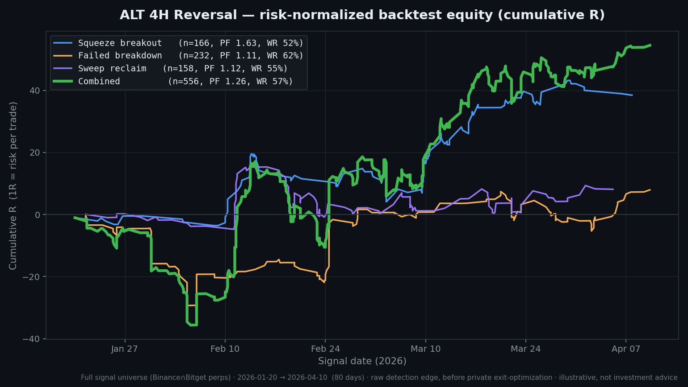

# ALT 4H Reversal Scanner

Scans ~150 USDT-M perpetual contracts (Binance ∩ Bitget) at every 4H candle close and fires LONG reversal signals from **three independent detectors** — squeeze breakout, failed breakdown, and sweep reclaim — under a multi-stage filter and regime-classification stack.

This is a **signal-generation and logging tool**. It produces structured output for manual or automated review. Execution, position sizing, and live risk management are **not** included (see [What is NOT in this version](#what-is-not-in-this-public-version)).

---

## Why three detectors

Reversals off a local bottom don't all look the same. A volatility squeeze that resolves up is a different microstructure than a stop-run that sweeps liquidity and reclaims. Instead of one fuzzy "divergence" rule, this scanner runs three tight, orthogonal detectors and tags each signal with the one that fired:

| Sub-tag | Detector | Core logic | TP ladder (R) |
|---|---|---|---|
| `_squeeze` | `detect_squeeze_breakout` | Bollinger-band squeeze (width < 0.8× its 30-bar median) resolving with a bullish close above the upper band | `[0.9, 1.6, 2.5, 4.0, 6.0]` |
| `_failedbd` | `detect_failed_breakdown` | Bar breaks below the 60-bar low intrabar but **closes back above** it — a failed bear breakout | `[0.6, 1.2, 2.0, 3.0, 5.0]` |
| `_sweep` | `detect_sweep_reclaim` | Multi-bar liquidity sweep below the prior 30-bar low, then reclaim with a higher close | `[1.0, 2.0, 3.0, 5.0, 8.0]` |

Each detector emits its own stop (referenced to an ATR buffer below the pattern low, exited on a **2H candle close** — not an intrabar wick) and a 5-level R-multiple take-profit ladder.

---

## Filter stack

A detector firing is necessary but not sufficient. Each candidate passes through:

1. **RSI context** — 4H RSI below `RSI_OVERSOLD_MAX` (a high RSI is not a bottom reversal).
2. **Volatility-regime floor** — `atr_pct_4h ≥ 0.04`. Backtest shows profit factor rises monotonically with 4H ATR%.
3. **Liquidity floor** — 30-day USD volume ≥ `MIN_VOL_30D_USD` (drops thin/exotic listings).
4. **Day/hour blacklist** — a small set of `(weekday, hour_utc)` cells with persistently weak historical performance.
5. **Cohort filter** — symbols are bucketed into liquidity terciles; weak `(detector × cohort)` cells are dropped.
6. **MTF 1H confirmation** — a 4H setup must be confirmed by a bullish 1H structure (engulfing / hammer / two higher closes) within a rolling window before it fires.
7. **BTC regime** *(optional, off by default)* — gate on BTC 7-day trend.
8. **Freshness guard** — a signal is suppressed if the latest closed 1H bar already traded through TP1 or the stop.

The result fires roughly **1–3 times per day** across the whole universe.

---

## Regime-adaptive take-profits

The take-profit ladder is not static. A volatility-regime classifier (`detect_volatility_regime`) maps current conditions to a `(R-multiple profile × weight profile)` cell, so the same detector spaces and weights its targets differently in a choppy market than in a trending one. The `_squeeze` detector additionally uses a mean-reversion **entry ladder** (scaling into the move) where backtests showed it improves the profit factor.

---

## Backtest results

> **Honesty note.** Two different figures appear below and they measure different things. Read both.

### Raw detection edge (what this public code produces)

The chart is the **risk-normalized** (1R = risk per trade) cumulative backtest of the three detectors on the full signal universe — every detector fire, before any exit optimization. This is the closest honest proxy for what the signal logic in this repo produces on its own.



| Detector | Signals | Profit factor | Win rate |
|---|---|---|---|
| Squeeze breakout | 166 | **1.63** | 52% |
| Failed breakdown | 232 | 1.11 | 62% |
| Sweep reclaim | 158 | 1.12 | 55% |
| **Combined** | **556** | **1.26** | **57%** |

*Period: 2026-01-20 → 2026-04-10 (80 days), Binance ∩ Bitget perps.*

### Optimized walk-forward (with a full exit-management stack — not in this repo)

With a per-detector exit-shaping and entry-ladder stack layered on top (break-even shifting, partial scaling, regime-conditional overrides — the execution layer, which is **not** part of this public release), rolling walk-forward validation (k=3, n≈184) reads:

- **PF 1.92 in-sample / 2.56 median out-of-sample.**
- **Realistic-close** (fees + conservative fill assumptions): **PF ≈ 1.53–1.85.**
- **Regime-conditional:** the edge is meaningfully stronger in trending/bull regimes (≈1.84) and compresses toward break-even in chop. An early paper-gate read of "PF 3.02 / 63% win" was **sim-optimism** and is deliberately not used as the headline number.

The takeaway: the detection logic carries a real but **modest and regime-dependent** raw edge; most of the headline PF comes from exit management, which is intentionally out of scope here.

---

## Output format

Each fired setup is written to the log file and, optionally, posted to Telegram:

```
#longalt_reversal_squeeze
Pair: ACEUSDT
Entry: 1.234560 (20%), 1.221230 (30%), 1.208900 (50%)
Targets: 1.258000 (5%), 1.281000 (10%), 1.317000 (20%), 1.378000 (25%), 1.460000 (40%)
Stop: 2H close below 1.180000
```

Single-entry detectors emit `Entry: <price> (100%)`. The Telegram message shows the unified `#longalt_reversal` tag; the log keeps the detector sub-tag.

---

## Quickstart

```bash
cd scripts/alt_4h_reversal_scanner
pip install -r requirements.txt

export BINANCE_API_KEY="your_read_only_key"     # public market data only
export BINANCE_API_SECRET="your_secret"
export TELEGRAM_BOT_TOKEN="your_bot_token"       # optional
export TELEGRAM_CHAT_ID="your_chat_id"           # optional

python signal_bot.py
```

The scanner aligns to the 4H candle grid (with a 1H confirmation tick) and runs indefinitely. Without Telegram credentials it runs fine and writes everything to the log file.

---

## Configuration reference

| Variable | Default | Description |
|---|---|---|
| `BINANCE_API_KEY` / `BINANCE_API_SECRET` | — | Read-only Binance keys (public data only) |
| `TELEGRAM_BOT_TOKEN` / `TELEGRAM_CHAT_ID` | — | Telegram delivery (optional) |
| `TELEGRAM_GROUP_CHAT_ID` / `TELEGRAM_TOPIC_THREAD_ID` | — | Optional group/topic delivery |
| `TOP_N` | `300` | Max symbols ranked into the universe |
| `MIN_VOL_30D_USD` | `10000000` | 30-day USD volume liquidity floor |
| `RSI_OVERSOLD_MAX` | `70` | Max 4H RSI at signal time |
| `ATR_PCT_4H_MIN` | `0.04` | Minimum 4H ATR% (volatility-regime floor) |
| `SQUEEZE_DETECTOR_ENABLED` | `1` | Toggle squeeze detector |
| `FAILED_BD_DETECTOR_ENABLED` | `1` | Toggle failed-breakdown detector |
| `SWEEP_DETECTOR_ENABLED` | `1` | Toggle sweep-reclaim detector |
| `MTF_1H_CONFIRM_ENABLED` | `1` | Require 1H confirmation |
| `COHORT_FILTER_ENABLED` | `1` | Drop weak `(detector × cohort)` cells |
| `DOW_HOUR_BLACKLIST_ENABLED` | `1` | Drop weak `(weekday, hour)` cells |
| `BTC_GATE_ENABLED` | `0` | Optional BTC-regime gate |
| `REGIME_ADAPTIVE_TP_ENABLED` | `1` | Regime-adaptive TP ladders |
| `SIGNAL_COOLDOWN_H` | `24` | Hours before re-firing the same symbol |

(See `.env.example` for the full list.)

---

## What is NOT in this public version

- **Execution layer** — order placement, fills, cancel/replace, maker-limit laddering.
- **Live exit management** — break-even shifting, trailing, partial scaling, the per-detector exit-shaping stack that produces the optimized PF figures above.
- **Position sizing & portfolio risk** — allocation, concurrent-position caps, exposure limits.
- **ML logging / training-set export** and any private signal-bus / engine integration.

What ships here is the **detection and signal-construction core**: universe building, the three detectors, the filter stack, regime classification, and TP/SL computation.

---

## Disclaimer

This tool generates structured output from technical filters. It is **not financial advice** and not a recommendation to buy or sell any asset. Backtest results are in-sample or limited-window, are sensitive to regime, and **do not predict future performance**. Crypto perpetuals are high-risk. Use at your own risk.

---

## License

Apache 2.0 — see the repository root [LICENSE](../../LICENSE).
