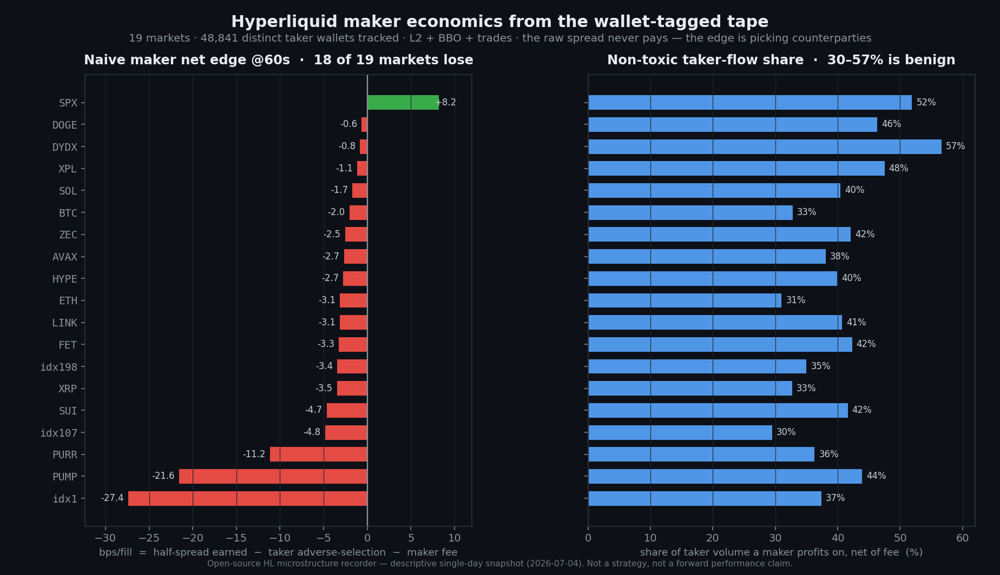

# Hyperliquid Microstructure Recorder + Toxicity Toolkit

**Record Hyperliquid's wallet-tagged order flow, then measure — per market and per counterparty wallet — whether a market maker actually makes money.**

Most microstructure recorders capture price and depth. Hyperliquid's trade tape carries something almost no other venue exposes: **both counterparty addresses on every fill.** That turns "was this flow toxic?" from a guess into a direct measurement. This repo is the isolated, append-only recorder that captures that tape (L2 book + BBO + trades) *plus* a toolkit that turns the corpus into the one number a maker cares about — **adverse selection, resolved down to the individual taker wallet.**

No trading. No API keys. No strategy. Just the data an MM needs and the tools to read it honestly.



> One day of capture, 19 markets, ~49k distinct taker wallets. **The quoted spread never pays on its own** — on 18 of 19 markets a maker quoting naively into the raw tape is negative after adverse selection and fee. But **30–57% of taker flow is non-toxic.** The edge was never the spread; it's *which counterparties you let fill you* — and that is exactly what wallet-tagged data lets you measure. (Descriptive single-day snapshot, not a strategy or a forward claim.)

---

## Why this is worth your attention

- **Wallet-level adverse selection.** Because HL prints `users = [buyer, seller]` on every trade, `toxicity.py` attributes each fill to a real taker address and ranks the wallets imposing the most adverse selection on makers. That is the difference between "spreads look tight" and "spreads look tight *but a handful of wallets eat every fill.*"
- **The maker's real question, answered from the tape:** `maker_net = half_spread − taker_markout − fee`. Positive means a maker profits against that flow net of fees. The toolkit reports it per coin, per horizon (60s / 300s), and per wallet.
- **It captures what others drop.** Funding, OI, and full L20 depth alongside trades — the signals that are invisible in a trades-only feed but define whether a book is maker-friendly.
- **Deployment discipline built in.** Hourly-rotated gzip JSONL, `recv_ts_ms` on every record for latency/gap analysis, a self-writing `health.json`, an independent capture watchdog, and an activity-driven universe manager (because on HL spot, reported volume is a *trap* — see below).

---

## What it records

`hl_l2_recorder.py` (~145 lines, one file, `websockets`-only) subscribes per coin to three streams and writes gzip JSONL, hourly-rotated and partitioned:

```
<out>/<stream>/dt=YYYY-MM-DD/coin=<COIN>/<HH>.jsonl.gz
```

| Stream | What it is | Cadence |
|---|---|---|
| `l2Book` | 20-level depth snapshots | ~7–8 s per coin (HL interval push) — the strict liveness gate |
| `bbo` | best bid/offer | event-driven, ~5–10 Hz on majors — the primary sim clock |
| `trades` | every print: px/sz/side/time/hash **+ both counterparty addresses** | live |

Every record is wrapped as `{"recv_ts_ms": <local ms>, "d": <exchange payload>}` so exchange-vs-receive latency and gaps stay measurable after the fact. Reconnect-with-backoff; a `health.json` snapshot (per-channel last-message ts + counts) is rewritten every 30 s. Disk ≈ 2–4 GB/day at 12 coins.

Coins are perps by symbol (`BTC`, `ETH`, …) or spot by index / pair (`@107`, `PURR/USDC`).

---

## The toxicity toolkit (pure standard library — no deps)

Four analysis tools, all reading the recorded corpus, all built on one **empirically verified** attribution rule (side `A` = taker sold, `B` = taker bought; `users = [buyer, seller]`, so the taker is a side-dependent slot — re-confirmed per run via a busiest-wallet diagnostic):

| Tool | The question it answers |
|---|---|
| **`toxicity.py`** | Per coin and **per taker wallet**: is a maker profitable against this flow net of fee? Reports taker markout, maker gross/net @60s & @300s, non-toxic volume share, and the top adverse-selection wallets. |
| **`toxicity_intraday.py`** | Is toxicity a *persistent intraday regime* you could gate on in real time? Bins the day, measures state autocorrelation and half-life — a gate is only viable if the state persists longer than the lag to detect it. |
| **`toxicity_depth.py`** | Does resting **deeper than the touch** rescue the maker? Fits the λ(δ) fill-intensity curve that an Avellaneda–Stoikov quoter needs to choose optimal depth, straight from the tape. |
| **`toxicity_persistence.py`** | Do toxic wallets *stay* toxic train→test? Measures stay-toxic precision, rank stability, and the actual net lift from refusing train-flagged wallets — i.e. whether a toxic-avoidance rule is real or in-sample noise. |

`first_look.py` gives a fast per-coin snapshot (spread percentiles, depth, volatility, trade rate, spread-vs-fee) for any capture.

---

## Quickstart

```bash
pip install -r requirements.txt          # just `websockets`

# 1. Record (public WS — no keys). Ctrl-C to stop; files are append-safe.
HL_MM_OUT=./data \
HL_MM_COINS="BTC,ETH,SOL,HYPE,PURR/USDC,@107" \
python hl_l2_recorder.py

# 2. After some capture, measure maker economics + wallet toxicity:
python toxicity.py --root ./data --coins BTC,ETH,SOL,PURR/USDC --json

# 3. Fast microstructure snapshot of everything captured:
python first_look.py ./data
```

Nothing here places an order or needs an account — it only reads Hyperliquid's public websocket.

---

## Operations (optional, for continuous capture)

- **`hl_mm_watchdog.py`** — systemd-timer oneshot that verifies *fresh data actually lands* (health age, per-channel staleness with an l2Book-freshness veto for quiet long-tail coins, newest-file age, unit active, free disk). Telegram alert on failure with cooldown + a single recovery message. Independent of the recorder process.
- **`hl_universe_manager.py`** — activity-driven universe rotation. Prunes coins that stop ticking and (optionally, probe-confirmed) adds active perps. **Key insight baked in:** HL *spot* `dayNtlVlm` is a useless selection signal (observed: a pair reporting \$68M/day that ticked its book 10× in 18 h, while the most active spot book we record reported \$27/day). Removal is therefore driven only by *observed* BBO/trade activity from the recorder's own `health.json`, never by reported volume.
- **`systemd/`** + **`DEPLOYMENT.md`** — service/timer units and a deployment layout for running this 24/7.

---

## Data schema (per record)

```jsonc
// trades/dt=…/coin=BTC/14.jsonl.gz
{"recv_ts_ms": 1751...., "d": [{"coin":"BTC","side":"B","px":"...","sz":"...","time":...,"hash":"0x…","users":["0x…buyer","0x…seller"]}]}

// bbo/…    {"recv_ts_ms":…, "d":{"coin":"BTC","time":…,"bbo":[{"px":…,"sz":…}, {"px":…,"sz":…}]}}
// l2Book/… {"recv_ts_ms":…, "d":{"coin":"BTC","time":…,"levels":[[…bids…],[…asks…]]}}
```

---

## What is intentionally NOT in this repo

This is the **data-capture and measurement** layer only. Deliberately excluded:

- Any quoting / sizing / entry / exit logic — the market-making strategy itself.
- The fill-model simulator and its calibration.
- Any live execution, position, or account code.

The recorder has no knowledge of a strategy; the toxicity tools are **descriptive microstructure analysis**. Publishing them exposes no alpha — they measure the *market*, not a way to trade it.

---

## Disclaimer

Descriptive research tooling. All numbers shown are **single-day, in-sample snapshots** of public market data and are **not** forward performance claims, trading advice, or a recommendation to make markets on any venue. Adverse selection is regime-dependent and can flip day to day (the toolkit exists precisely to measure that). Crypto trading is high-risk. Use at your own risk.

---

## License

Apache 2.0 — see the repository root [LICENSE](../../LICENSE).
