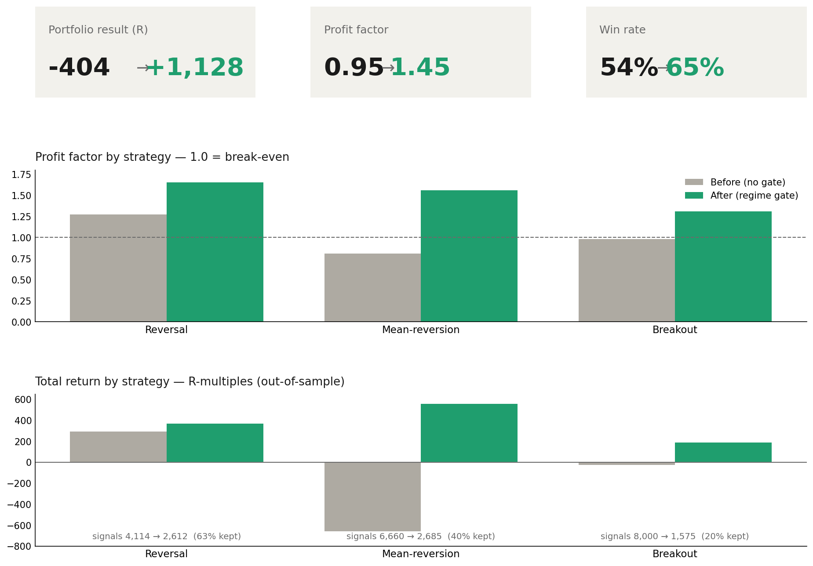

# Long-Gate Orchestrator

**A causal regime-gating layer for swing-long strategies — trade them only when the market regime is favorable, suppress the downtrend tail.**

A second safety contour for a multi-strategy long book. Instead of tuning each strategy's signals, the orchestrator answers one question per signal: *given the current market regime, should this strategy trade at full size, half size, or not at all?*

```
decide(strategy, ts) -> {size_mult ∈ {0, 0.5, 1.0}, trade, reason, features}
```

It is **causal, market-state, and indicator-agnostic**: its only inputs are a shared regime panel (BTC trend state, risk-off level, EMA55 regime) plus, for one strategy, that signal's own ATR. It does **not** touch signal detection or the execution engine — it sizes at the moment a signal is emitted.

---

## Why this exists

Most strategy work tunes the *signal* — entries, exits, indicators. But for a family of swing-long strategies, the dominant lever is often the **market regime**: the same signal that prints money in an uptrend bleeds in a downtrend. Rather than bolt a bespoke filter onto each strategy, build **one shared regime panel** and a thin per-strategy decision layer on top. One validated, monitorable gate converts regime knowledge into sizing across the whole book.

Two load-bearing ideas (both validated out-of-sample):

1. **A shared feature panel + per-strategy thresholds** beats both ungated trading and each strategy's bespoke gate. One axis is usually a *backbone* (here: BTC 3-day return); a per-strategy second axis refines the profit factor and trims the tail.
2. **Compose with a strategy's native edge, don't replace it.** The breakout sleeve's real lever was its own per-coin low-ATR calm filter — dropping it for a pure market axis broke the holdout. The gate adds a market axis *on top of* the native filter.

---

## Results

Out-of-sample validation across three long strategies (R-multiples — no account values):



| Strategy | Verdict | Profit factor | Out-of-sample notes |
|----------|---------|---------------|---------------------|
| Reversal | **GO** | 1.28 → 1.51 | Already had standalone edge; the gate is a risk overlay that lifts PF and trims the tail while keeping ~63% of signals |
| Mean-reversion | **GO** (regime-conditional) | 0.81 → 1.56 | The biggest win — the gate converts a structurally-losing ungated sleeve into a positive, validated one |
| Breakout | **WATCH** (shadow only) | 0.98 → 1.31 | Genuine selection skill, but in the recent regime it's a loss-reducer, not a profit source — wired but allocated zero capital until a favorable regime returns |

**Honest haircut:** out-of-sample return is ~40–50% of the in-sample headline — consistent with expected simulation→OOS decay. The edge is real but roughly half the in-sample figure. The gate shrinks the bad-regime loss; it does not erase it.

---

## Quickstart

```bash
cd scripts/long_gate_orchestrator
pip install -r requirements.txt

# 1. Core decision API — runs on the bundled sample regime panel
python3 gate_orchestrator.py
#   reversal  TRADE size=1.0   btc_r3=+0.019 >= -0.02
#   meanrev   TRADE size=1.0   btc_r3(lag8)=+0.025 >= -0.02 & riskoff_z<0.5 -> True
#   breakout  TRADE size=1.0 (shadow-only)   ema55_up(lag8)=1.0 & atr_pct=0.02 <= 0.023

# 2. Generate a synthetic demo signal table, then run the A/B shadow replay
python3 data/make_demo_table.py
python3 forward_shadow.py --replay

# 3. Parameter sweep and the out-of-sample validation battery (on the demo table)
python3 optimization/gate_sweep.py
python3 validation/wfo.py
```

> **Note on the bundled data.** `data/panel/regime_panel.csv` is a real sample regime panel (market-state features only — no positions, balances, or account data). The signal table is **synthetic** (`data/make_demo_table.py`) so every script runs out of the box. The real per-signal return corpus is intentionally not published, so the validation battery will (correctly) reject the synthetic data — that is the battery working, not an edge. The validated results above came from the real corpus.

---

## How it works

```
            shared regime panel (causal, 4h cadence, known_at = bar close)
            btc_r3 · riskoff_z · btc_ema55_up · breadth · |btc_trend_z| · ...
                              │
        ┌─────────────────────┼─────────────────────┐
        ▼                     ▼                     ▼
   reversal gate         meanrev gate          breakout gate
   btc_r3 ≥ −0.02     btc_r3(lag8) ≥ −0.02     ema55_up(lag8)
                       ∧ riskoff_z < 0.5        ∧ atr_pct ≤ ~q25
        │                     │                     │
        └─────────────────────┴─────────────────────┘
                              ▼
                  size_mult ∈ {0, 0.5, 1.0}   (0.5 = graded soft band)
                              ▼
              applied at signal-emit — detection & execution untouched
```

The gate runs at the **source**: a suppressed signal is never written downstream, so any consumer inherits the decision with nothing to install. Cross-cutting regime features are published once; each strategy's native features stay in its own scanner.

---

## Validated configs

| Strategy | Rule | Capital |
|----------|------|---------|
| `reversal` | `size=1.0 if btc_r3 ≥ −0.02 else 0.0` | eligible |
| `meanrev` | `size=1.0 if btc_r3(lag8) ≥ −0.02 ∧ riskoff_z < 0.5 else 0.0` | eligible |
| `breakout` | `size=1.0 if ema55_up(lag8) ∧ atr_pct ≤ ~0.023 else 0.0` | **shadow only** (zero capital until forward-shadow confirms a favorable regime) |

A `graded=True` mode returns `0.5` instead of `0.0` in the soft band (size-down rather than hard-skip near regime edges).

---

## File map

```
gate_orchestrator.py        # the decide() API — causal regime gate per strategy
forward_shadow.py           # A/B harness: gated vs ungated control (the live GO/no-go test)
optimization/
  gate_sweep.py             # curated gate-architecture sweep (bounded objective + maximin worst-fold)
  refine_sweep.py           # continuous-threshold + per-strategy 2-D refinement
validation/
  wfo.py                    # the anti-overfit battery: WFO + clean holdout + placebo + episode honesty
data/
  panel/regime_panel.csv    # sample regime panel (real market-state features)
  make_demo_table.py        # generates a synthetic signal table so the demos run
docs/
  make_figure.py            # regenerates results.png
  results.png               # the before/after figure above
```

See [METHODOLOGY.md](METHODOLOGY.md) for the full P0→P5 pipeline recipe and the validation battery.

---

## What is intentionally NOT here

- The real per-signal return corpus (the strategies' settled `realized_R`) — replaced by a synthetic demo table.
- The signal detectors / execution engines for the three strategies (they live in their own projects).
- Deployment wiring (VPS publisher, cron, monitor) — environment-specific.

---

## Disclaimer

Research and educational software. Regime gating reduces but does not eliminate drawdown; out-of-sample results are materially smaller than in-sample. Nothing here is financial advice. Automated trading carries substantial risk of loss.

## License

MIT — see repo root [LICENSE](../../LICENSE).
